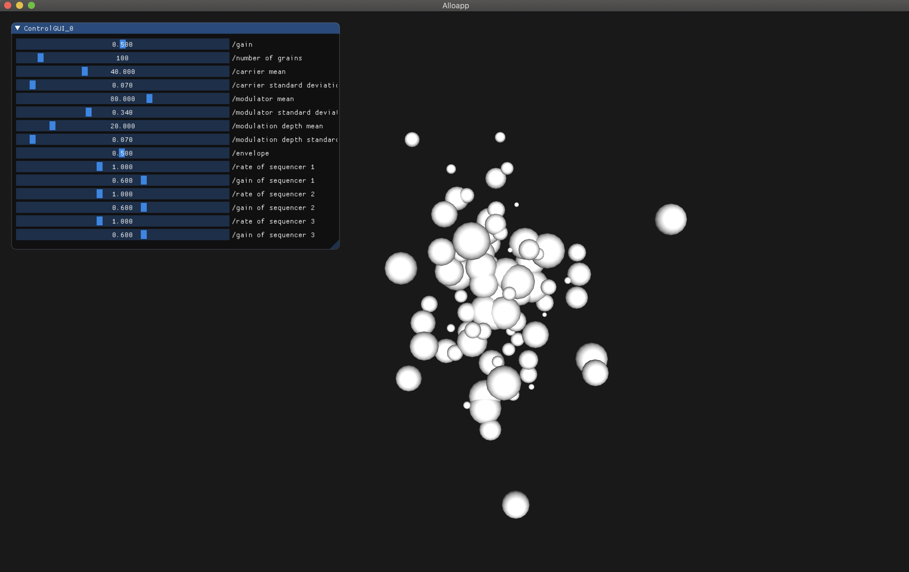
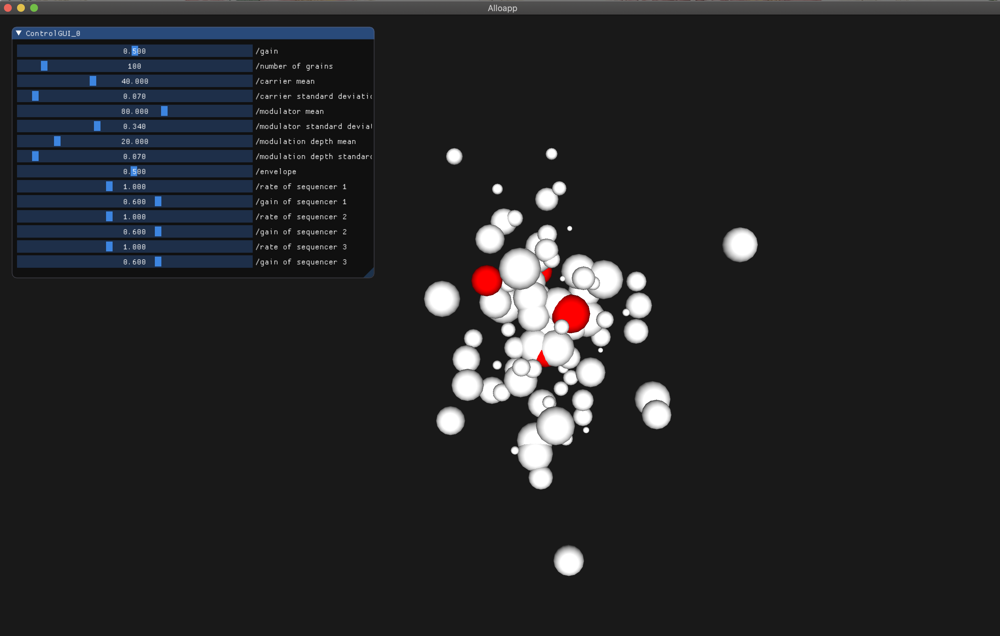
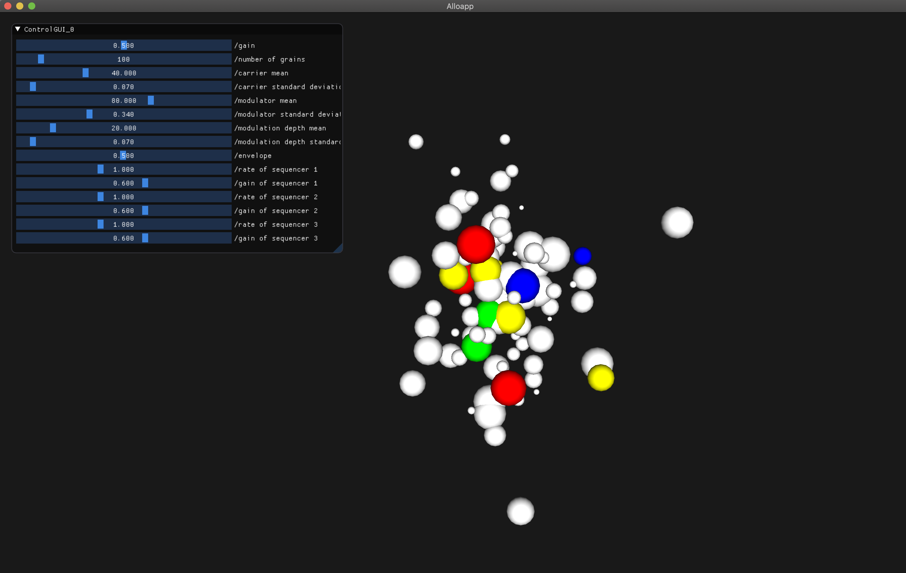
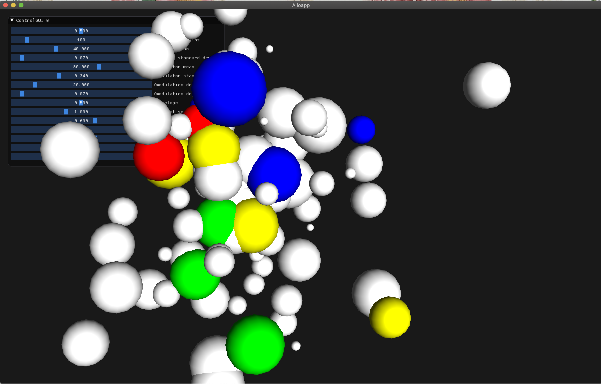

# ReSynth

By Stejara Dinulescu

Final project for MAT240B class taught by Karl Yerkes, Winter 2021.

## Abstract

ReSynth is a personal tool for experimentation with sound, enabling playful music composition via granular and Frequency Modulation (FM) synthesis techniques. Each grain is a sinusoidal chirplet with unique properties, which include:

1. duration
2. envelope (simple attack and decay)
3. starting and ending carrier frequencies
4. starting and ending modulator frequencies
5. starting and ending modulation index values (modulation depth)

These properties are set via user-controlled sliders in the top left of the screen.  A description of these sliders can be found in the section below.

## Slider Functionality

The sliders can be conceptually partitioned into three categories: system control, grain setting control, and sequencer control. 

*System Control*

1. gain -- overall system's volume control
2. number of grains -- how many grains are visualized on-screen at once

*Grain Setting Control*

3. carrier mean -- this is the mean value used to compute starting and ending carrier frequency of the grains
4. carrier standard deviation -- this is the amount of deviation from the carrier mean, with a value closer to 1.0 indicating less deviation from the mean
5. modulator mean -- this is the mean value used to compute starting and ending modulation frequency of the grains
6. modulator standard deviation -- this is the amount of deviation from the modulator mean, with a value closer to 1.0 indicating less deviation from the mean
7. modulation depth mean -- this is the mean value used to compute starting and ending modulation index
8. modulation depth standard deviation -- this is the amount of deviation from the modulator mean, with a value closer to 1.0 indicating less deviation from the mean
9. envelope -- this is the parameter that enables users to control the attack (duration * envelope), sustain (envelope), and decay((1-envelope) * duration) values.

The sliders in this category do not affect the state of the grains until the user presses the spacebar.  All other sliders immediately change the state of the system.

*Sequencer Control* 

There are a total of three sequencers able to be handled by the user, with two parameters (rate and gain), detailed below. 

10. rate of sequencer 1 -- controls the speed at which sequencer 1 plays through the selected grains
11. gain of sequencer 1 -- controls the volume of sequencer 1
12. rate of sequencer 2 -- controls the speed at which sequencer 2 plays through the selected grains
13. gain of sequencer 2 -- controls the volume of sequencer 2
14. rate of sequencer 3 -- controls the speed at which sequencer 3 plays through the selected grains
15. gain of sequencer 3 -- controls the volume of sequencer 3

## Interactivity

At the start of the program, 100 grains are displayed on-screen with default settings, as depicted by the GUI parameter values.  Grains are spaced out on-screen based on their carrier frequency (mapped to the x axis), modulator frequency (mapped to the y axis), and modulation depth values (mapped to the z axis).  Their size is indicative of the grain's duration -- smaller spheres indicate shorter grains, as short as 10 miliseconds in length.

Hovering over a grain will trigger it to play, which makes the grain flash red throughout its duration.

Grains can be chained together in sequence to begin to form compositions of sound.  However, a sequencer must first be activated.  At the current state of the tool, 3 sequencers can be handled simultaneously.  They can be activated via keypress, with 1 activating sequencer 1 (and so forth).  Each sequencer's rate and gain can be controlled independently, enabling a wider range of expressive compositional outcomes. 

Lastly, Resynth's reliance on allolib as a framework enables navigational interactions.   The arrow, wadx, and shift keys facilitate navigation through the rendered world to help the user in exploring all of the grains in the world, as well as to engage the user in their experience with the tool. 

Lastly, hitting the spacebar will recompute all grain settings based on the parameters specified by the user via the GUI. 